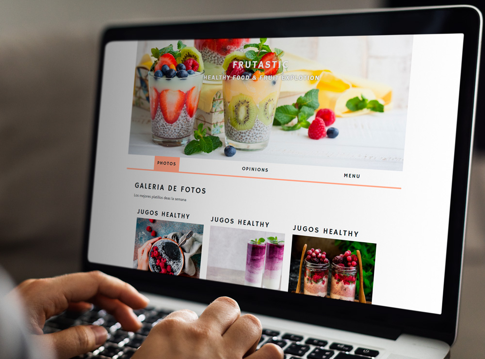

  <h1 align="center">Rataurant Page</h1>

  

    Beautiful tab-based webpages for the restaurant with clean web design.
    In this project, I developed a restaurant webpage for practicing DOM manipulation by dynamically rendering HTML web pages.
  

## Preview:

### Built with

- HTML
- JavaScript
- CSS

## Setup and run the app

> Follow these steps to set up and run the quickstart:
  - Clone/Download this repo and open this folder in a Terminal.
    `git clone https://github.com/abredi/restaurant-page.git`
  - Install the Nodejs:
  [https://nodejs.org/en/download/](https://nodejs.org/en/download/)

  - Run npm install on your terminal *be sure that you are in the project's directory*:
  `npm intall`
  - Finally run a local server:
  `npm run build`

### Live Demo :

[Click here](https://jessicafarias.github.io/RestaurantPage/)

### Author

👤 **Jessica Michelle Farías Rosado**

- Website [jessicafarias.me](http://jessicafarias.me/)
- Twitter: [@FariasRosado](https://twitter.com/FariasRosado)
- Linkedin: [linkedin](https://www.linkedin.com/in/jessica-michelle-farias-rosado/)

## 🤝 Contributing

Contributions, issues and feature requests are welcome!

Feel free to check the [issues page](https://github.com/jessicafarias/RestaurantPage/issues).

## Show your support

Give a ⭐️ if you like this project!